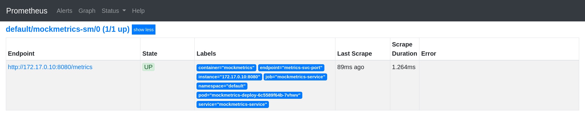

# Kubernetes autoscaling with custom metrics

In this demo we will deploy an app mockmetrics which will generate a count at `/metrics`. These metrics will be scraped by Prometheus. With the help of [`k8s-prometheus-adapter`](https://github.com/DirectXMan12/k8s-prometheus-adapter), we will create APIService `custom.metrics.k8s.io`, which then will be utilized by HPA to scale the deployment of mockmetrics app (increase number of replicas).

## Prerequisite
- You have a running Kubernetes cluster somewhere with kubectl configured to access it.
- Clone the repo.
  ```
  git clone https://github.com/infracloudio/kubernetes-autoscaling.git
  cd kubernetes-autoscaling
  ```
- If you are using GKE to create the cluster make sure you have created ClusterRoleBinding with 'cluster-admin' ([_instructions_](https://stackoverflow.com/a/47332612/6202405)).
- We will be using [Helm](https://helm.sh/docs/intro/install/) to install some of the components we need for this demo.


## Installing Prometheus Operator and Prometheus
Now, we will install [kube-prometheus-stack](https://github.com/prometheus-community/helm-charts/tree/main/charts/kube-prometheus-stack) chart. It will deploy [Prometheus Operator](https://github.com/coreos/prometheus-operator) and create an instance of Prometheus using it.

- Add prometheus-community Helm repository and create `monitoring` namespace.

  ```console
  $ helm repo add prometheus-community https://prometheus-community.github.io/helm-charts
  "prometheus-community" has been added to your repositories
  
  $ helm repo add stable https://charts.helm.sh/stable
  "stable" has been added to your repositories
  
  $ helm repo update
  Hang tight while we grab the latest from your chart repositories...
  ...Successfully got an update from the "prometheus-community" chart repository
  ...Successfully got an update from the "stable" chart repository
  Update Complete. ⎈ Happy Helming!⎈ 

  $ kubectl create namespace monitoring
  namespace/monitoring created
  ```
- Install kube-prometheus-stack.

  This will install Prometheus Operator in the namespace `monitoring` and it will create [`CustomResourceDefinitions`](https://kubernetes.io/docs/concepts/extend-kubernetes/api-extension/custom-resources/#customresourcedefinitions) for `AlertManager`, `Prometheus` and `ServiceMonitor` etc.
  ```
  $ helm install mon \
      --namespace monitoring \
      prometheus-community/kube-prometheus-stack
  ```
  ```console
  $ kubectl get crd --namespace monitoring
  NAME                                        CREATED AT
  alertmanagers.monitoring.coreos.com         2020-12-18T13:05:10Z
  podmonitors.monitoring.coreos.com           2020-12-18T13:05:10Z
  prometheuses.monitoring.coreos.com          2020-12-18T13:05:10Z
  servicemonitors.monitoring.coreos.com       2020-12-18T13:05:11Z
  …
  ```

- Check if all the components are deployed properly.
  ```console
  $ kubectl get pods --namespace monitoring
  NAME                                                    READY   STATUS    RESTARTS   AGE
  alertmanager-mon-kube-prometheus-stack-alertmanager-0   2/2     Running   0          7m1s
  mon-grafana-5f64b7d85c-z58lc                            2/2     Running   0          7m19s
  mon-kube-prometheus-stack-operator-7886b467cd-t5x8l     1/1     Running   1          7m19s
  mon-kube-state-metrics-84cc9dd77b-fj8nx                 1/1     Running   2          7m19s
  mon-prometheus-node-exporter-8w5q6                      1/1     Running   1          7m19s
  prometheus-mon-kube-prometheus-stack-prometheus-0       2/2     Running   1          41s
  ```

## Deploying the mockmetrics application

It's a simple web server written in Go which exposes total hit count at `/metrics` endpoint. We will create a deployment and service for it.

- This will create Deployment, Service, HorizontalPodAutoscaler in the `default` namespace and ServiceMonitor in `monitoring` namespace.
  ```console
  $ kubectl apply -f deploy/metrics-app/
  deployment.apps/mockmetrics-deploy created
  horizontalpodautoscaler.autoscaling/mockmetrics-app-hpa created
  servicemonitor.monitoring.coreos.com/mockmetrics-sm created
  service/mockmetrics-service created

  $ kubectl get svc,hpa
  NAME                          TYPE        CLUSTER-IP       EXTERNAL-IP   PORT(S)              AGE
  service/mockmetrics-service   ClusterIP   10.111.240.149   <none>        80/TCP               51s

  NAME                                                      REFERENCE                       TARGETS         MINPODS   MAXPODS   REPLICAS   AGE
  horizontalpodautoscaler.autoscaling/mockmetrics-app-hpa   Deployment/mockmetrics-deploy   <unknown>/100   1         10        1          51s
  ```
  _The `<unknown>` field will have a value once we deploy the custom metrics API server._

  The ServiceMonitor will be picked up by Prometheus, so it tells Prometheus to scrape the metrics at `/metrics` from the mockmetrics app at every 10s.
  <details>

  <summary>deploy/metrics-app/mockmetrics-service-monitor.yaml</summary>

  ```yaml
  apiVersion: monitoring.coreos.com/v1
  kind: ServiceMonitor
  metadata:
    name: mockmetrics-sm
    labels:
      release: mon
  spec:
    jobLabel: mockmetrics
    selector:
      matchLabels:
        app: mockmetrics-app
    endpoints:
    - port: metrics-svc-port
      interval: 10s
      path: /metrics
  ```

  </details>

  Let's take a look at [`Horizontal Pod Autoscaler`](https://kubernetes.io/docs/tasks/run-application/horizontal-pod-autoscale/).
  <details>

  <summary>deploy/metrics-app/mockmetrics-hpa.yaml</summary>

  ```yaml
  apiVersion: autoscaling/v2beta1
  kind: HorizontalPodAutoscaler
  metadata:
    name: mockmetrics-app-hpa
  spec:
    scaleTargetRef:
      apiVersion: apps/v1
      kind: Deployment
      name: mockmetrics-deploy
    minReplicas: 1
    maxReplicas: 10
    metrics:
    - type: Object
      object:
        target:
          kind: Service
          name: mockmetrics-service
        metricName: total_hit_count
        targetValue: 100
  ```

  </details>

  This will increase the number of replicas of `mockmetrics-deploy` when the metric `total_hit_count` associated with the service `mockmetrics-service` crosses the targetValue 100.

- Check if the `mockmetrics-service` appears as target in the Prometheus dashboard.
  ```console
  $ kubectl port-forward svc/mon-kube-prometheus-stack-prometheus 9090 --namespace monitoring
  Forwarding from 127.0.0.1:9090 -> 9090
  Forwarding from [::1]:9090 -> 9090
  ```
  Head over to http://localhost:9090/targets  
  It should look like something similar to this,
  
  

## Deploying the custom metrics API server (Prometheus Adapter)

- Create the resources required for deploying custom metrics API server using the [prometheus-adapter](https://github.com/prometheus-community/helm-charts/tree/main/charts/prometheus-adapter) chart.
  ```console
  $ kubectl create namespace prometheus-adapter
  namespace/prometheus-adapter created

  $ helm install prometheus-adapter \
      --namespace prometheus-adapter \
      -f deploy/custom-metrics-server/prometheus-adapter-values.yaml \
      prometheus-community/prometheus-adapter
  ```
  This will create all the resources in the `prometheus-adapter` namespace.
  - `deploy/custom-metrics-server/prometheus-adapter-values.yaml`  
    This values file for the chart configures how the metrics are fetched from Prometheus and how to associate those with the Kubernetes resources. More details about writing the configuration can be found [here](https://github.com/DirectXMan12/k8s-prometheus-adapter/blob/master/docs/config.md). [_A walkthrough of the configuration._](https://github.com/DirectXMan12/k8s-prometheus-adapter/blob/master/docs/config-walkthrough.md).
  - This chart creates ServiceAccount, ClusterRoles, RoleBindings, ClusterRoleBindings to grant required permissions to the adapter.
  - It also creates APIService, which is part of aggregation layer. It creates the API `v1beta1.custom.metrics.k8s.io`.

- Check if everything is running as expected.
  ```console
  $ kubectl get svc --namespace prometheus-adapter 
  NAME                 TYPE        CLUSTER-IP       EXTERNAL-IP   PORT(S)   AGE
  prometheus-adapter   ClusterIP   10.109.185.238   <none>        443/TCP   2m22s

  $ kubectl get apiservice | grep -E '^NAME|v1beta1.custom.metrics.k8s.io'
  NAME                                   SERVICE                                 AVAILABLE   AGE
  v1beta1.custom.metrics.k8s.io          prometheus-adapter/prometheus-adapter   True        14m
  ```
- Check if the metrics are getting collected, by querying the API `custom.metrics.k8s.io/v1beta1`.
  ```console
  $ kubectl get --raw "/apis/custom.metrics.k8s.io/v1beta1/namespaces/default/services/*/total_hit_count" | jq
  ```
  ```json
  {
    "kind": "MetricValueList",
    "apiVersion": "custom.metrics.k8s.io/v1beta1",
    "metadata": {
      "selfLink": "/apis/custom.metrics.k8s.io/v1beta1/namespaces/default/services/%2A/total_hit_count"
    },
    "items": [
      {
        "describedObject": {
          "kind": "Service",
          "namespace": "default",
          "name": "mockmetrics-service",
          "apiVersion": "/v1"
        },
        "metricName": "total_hit_count",
        "timestamp": "2020-12-18T14:04:28Z",
        "value": "0",
        "selector": null
      }
    ]
  }
  ```

## Scaling the application

- Check the `mockmetrics-app-hpa`.
  ```console
  $ kubectl get hpa
  NAME                  REFERENCE                       TARGETS   MINPODS   MAXPODS   REPLICAS   AGE
  mockmetrics-app-hpa   Deployment/mockmetrics-deploy   0/100     1         10        1          38m
  ```
- The mockmetrics application has following endpoints.
  - `/scale/up`: keeps on increasing the `total_hit_count` when `/metrics` is accessed
  - `/scale/down`: starts decreasing the value
  - `/scale/stop`: stops the increasing or decreasing value

- Open a new terminal tab.
  ```console
  $ kubectl port-forward svc/mockmetrics-service 8080:80 &
  Forwarding from 127.0.0.1:8080 -> 8080
  Forwarding from [::1]:8080 -> 8080

  $ curl localhost:8080/scale/
  stop
  ```
  Let's set the application to increase the counter.
  ```console
  $ curl localhost:8080/scale/up
  Going up!
  ```
  As Prometheus is configured to scrape the metrics every 10s, the value of the `total_hit_count` will keep changing.
- Now in different terminal tab let's watch the HPA.
  ```console
  $ kubectl get hpa -w
  NAME                  REFERENCE                       TARGETS   MINPODS   MAXPODS   REPLICAS   AGE
  mockmetrics-app-hpa   Deployment/mockmetrics-deploy   6/100     1         10        1          40m
  mockmetrics-app-hpa   Deployment/mockmetrics-deploy   30/100    1         10        1          40m
  mockmetrics-app-hpa   Deployment/mockmetrics-deploy   72/100    1         10        1          41m
  mockmetrics-app-hpa   Deployment/mockmetrics-deploy   90/100    1         10        1          41m
  mockmetrics-app-hpa   Deployment/mockmetrics-deploy   132/100   1         10        1          41m
  mockmetrics-app-hpa   Deployment/mockmetrics-deploy   78/100    1         10        2          42m
  mockmetrics-app-hpa   Deployment/mockmetrics-deploy   114/100   1         10        2          42m
  mockmetrics-app-hpa   Deployment/mockmetrics-deploy   92/100    1         10        3          42m
  mockmetrics-app-hpa   Deployment/mockmetrics-deploy   116/100   1         10        3          43m
  mockmetrics-app-hpa   Deployment/mockmetrics-deploy   93/100    1         10        4          43m
  …
  ```
  Once the value is greater than the target, HPA will automatically increase the number of replicas for the `mockmetrics-deploy`.
- To bring the value down, execute following command in the first terminal tab.
  ```console
  $ curl localhost:8080/scale/down
  Going down :P

  $ kubectl get hpa -w
  NAME                  REFERENCE                       TARGETS   MINPODS   MAXPODS   REPLICAS   AGE
  …
  mockmetrics-app-hpa   Deployment/mockmetrics-deploy   0/100        1         10        2          52m
  mockmetrics-app-hpa   Deployment/mockmetrics-deploy   0/100        1         10        2          52m
  mockmetrics-app-hpa   Deployment/mockmetrics-deploy   0/100        1         10        1          53m
  ```

## Clean up (optional)
To clean up all the resources created as part of this tutorial, run the following commands.

```console
$ helm delete prometheus-adapter --namespace prometheus-adapter
release "prometheus-adapter" uninstalled

$ kubectl delete -f deploy/metrics-app/
deployment.apps "mockmetrics-deploy" deleted
horizontalpodautoscaler.autoscaling "mockmetrics-app-hpa" deleted
servicemonitor.monitoring.coreos.com "mockmetrics-sm" deleted
service "mockmetrics-service" deleted

$ helm delete mon --namespace monitoring
release "mon" uninstalled
```

## Other references and credits
- Writing ServiceMonitor
  - [Cluster Monitoring using Prometheus Operator](https://github.com/coreos/prometheus-operator/blob/master/Documentation/user-guides/cluster-monitoring.md)
  - [Running Exporters](https://github.com/coreos/prometheus-operator/blob/master/Documentation/user-guides/running-exporters.md)
- [kube-prometheus](https://github.com/coreos/prometheus-operator/tree/master/helm/kube-prometheus)
- [Get Kubernetes Cluster Metrics with Prometheus in 5 Minutes](https://akomljen.com/get-kubernetes-cluster-metrics-with-prometheus-in-5-minutes/)
- [Kubernetes Metrics Server](https://github.com/kubernetes-incubator/metrics-server)
- [Custom Metrics Adapter Server Boilerplate](https://github.com/kubernetes-incubator/custom-metrics-apiserver)
- [Custom Metrics API design document](https://github.com/kubernetes/community/blob/master/contributors/design-proposals/instrumentation/custom-metrics-api.md)
- [DirectXMan12/k8s-prometheus-adapter](https://github.com/DirectXMan12/k8s-prometheus-adapter)
- [luxas/kubeadm-workshop](https://github.com/luxas/kubeadm-workshop)
- [Querying Prometheus](https://prometheus.io/docs/prometheus/latest/querying/basics/)

## Licensing
This repository is licensed under Apache License Version 2.0. See [LICENSE](./LICENSE) for the full license text.
